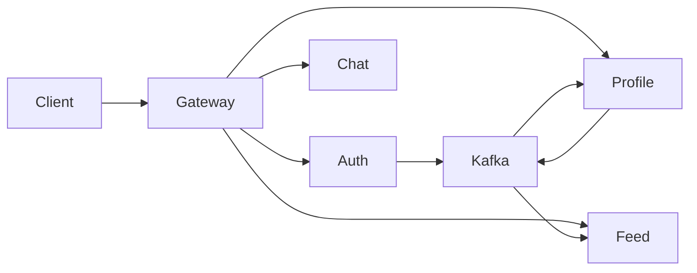
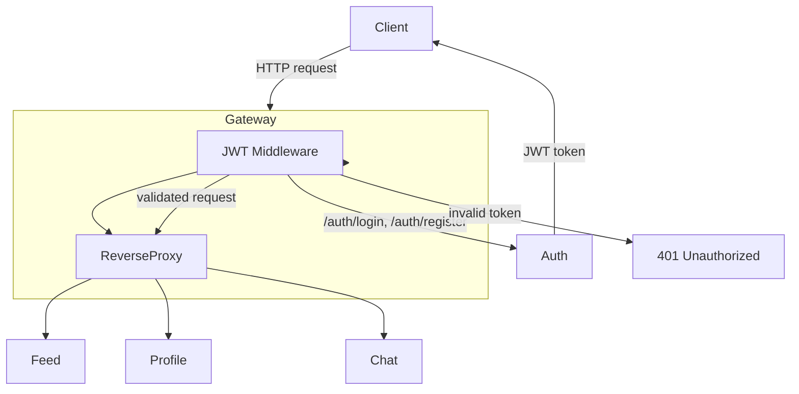
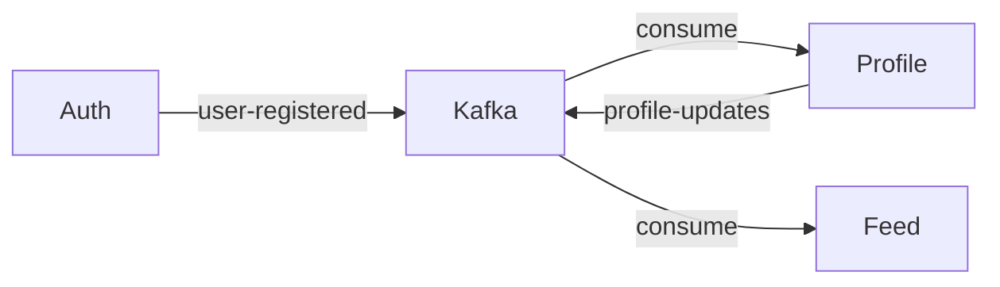
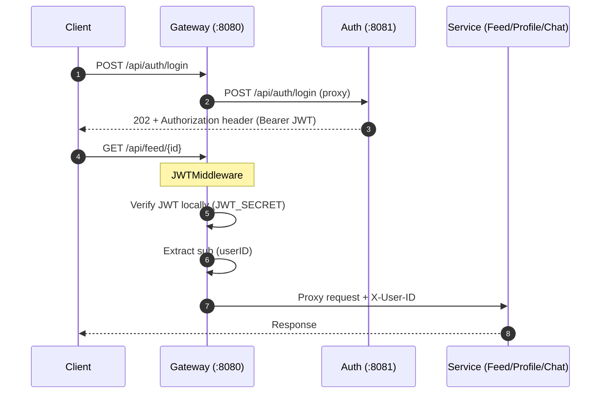
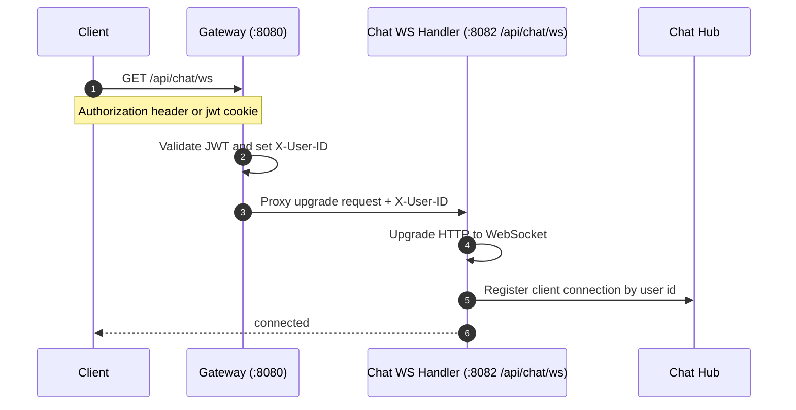
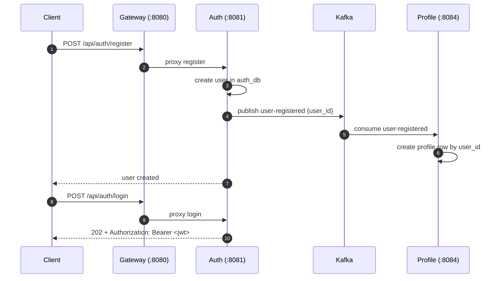
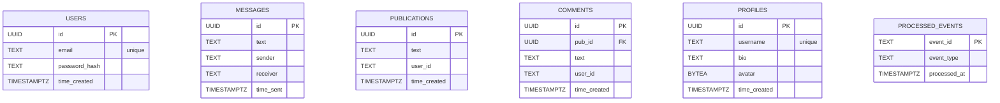

# Wave Connect

Go microservices backend for a small social-style app. It’s composed of an HTTP **gateway** (reverse proxy) plus **auth**, **chat**, **feed**, and **profile** services. Each domain service owns its own **Postgres** database and SQL migrations.

## Repo layout

- `backend-services/`: everything (services + docker compose)
  - `docker-compose.yml`: runs gateway, services, and 4 Postgres containers
  - `openapi.yaml`: gateway OpenAPI specification
  - `ENDPOINTS.md`: human-readable endpoint reference
  - `gateway-service/`: API gateway (reverse proxy + JWT auth middleware)
  - `auth-service/`: registration/login + JWT issuance + user lookup/delete
  - `chat-service/`: conversation APIs + message CRUD + WebSocket chat
  - `feed-service/`: publication + comments CRUD + feed listing endpoints
  - `profile-service/`: profile CRUD + avatar + Kafka events

## Tech stack

- **Language**: Go
- **Frontend**: React + TypeScript + Vite
- **HTTP**: Go stdlib `net/http` (`http.ServeMux` route patterns)
- **Style**: straightforward Go services built on stdlib (minimal framework magic)
- **Gateway proxy**: Go stdlib `net/http/httputil` reverse proxy
- **Auth**: JWT (`github.com/golang-jwt/jwt/v5`), password hashing (`golang.org/x/crypto`)
- **Realtime**: Gorilla WebSocket (`github.com/gorilla/websocket`) in chat-service
- **Messaging**: Kafka (`confluent-kafka-go`) for cross-service events
- **DB**: Postgres 16 (Docker), `pgx` (`github.com/jackc/pgx/v5`)
- **Migrations**: `golang-migrate` (`github.com/golang-migrate/migrate/v4`)
- **Config**: `viper` (`github.com/spf13/viper`)
- **API docs**: OpenAPI 3.0 (`backend-services/openapi.yaml`)
- **Dev orchestration**: Docker + Docker Compose

## Architecture
### High-level system (service boundaries)

### Request flow (Gateway + JWT)

### Event-driven flow (Kafka)


## Backend internal architecture (per service)

Each domain service follows a simple separation of concerns:

- **API layer**: HTTP handlers + (service-specific) middleware under `api/`
- **Realtime layer**: chat-service also includes a WebSocket hub under `api/websocket`
- **Business logic**: service layer under `internal/` (or similar)
- **Data access**: repository/data layer under `internal/` (Postgres via `pgx`)
- **Schema management**: SQL migrations under `migrations/`

## Auth flow (gateway + JWT)

### Login + using the token



### WebSocket auth flow



### Register + login + events



### What the gateway enforces

- `POST /api/auth/register` and `POST /api/auth/login` are proxied without JWT.
- Everything under:
  - `/api/auth/`
  - `/api/feed/`
  - `/api/profile/`
  - `/api/chat/`
  requires `Authorization: Bearer <token>`.
- On successful JWT verification, the gateway forwards `X-User-ID: <jwt subject>` to downstream services (used by feed service).
- Chat WebSocket connections also rely on that forwarded `X-User-ID`.
- The JWT middleware also accepts a `jwt` cookie as a fallback token source (useful for WebSocket connections).

## API endpoints

### Gateway (recommended entrypoint)

Base URL: `http://localhost:8080`

#### Auth (proxied to auth-service)

- `POST /api/auth/register`
- `POST /api/auth/login`
- `GET /api/auth/id/` (requires JWT)
- `DELETE /api/auth/` (requires JWT)

#### Feed (proxied to feed-service; requires JWT)

- `POST /api/feed/`
- `GET /api/feed/`
- `GET /api/feed/user/{userID}`
- `GET /api/feed/{id}`
- `PUT /api/feed/{id}`
- `DELETE /api/feed/{id}`
- `POST /api/feed/{pubID}/comment/`
- `GET /api/feed/{pubID}/comment/`
- `DELETE /api/feed/comment/{id}`

#### Profile (proxied to profile-service; requires JWT)

- `POST /api/profile/`
- `GET /api/profile/{id}`
- `GET /api/profile/username/{username}`
- `PUT /api/profile/`
- `DELETE /api/profile/`
- `PUT /api/profile/avatar/`
- `GET /api/profile/avatar/{id}`

#### Chat (proxied to chat-service; requires JWT)

- `GET /api/chat/conversation`
- `GET /api/chat/conversation/{peerID}`
- `GET /api/chat/{id}`
- `PUT /api/chat/{id}`
- `DELETE /api/chat/{id}`
- `GET /api/chat/ws`

Notes:

- WebSocket chat is enabled at `GET /api/chat/ws`
- direct chat health check is available at `GET http://localhost:8082/health`
- `POST /api/chat/` exists in the chat handler, but the route is currently commented out in `backend-services/chat-service/cmd/main.go`
- auth/profile/feed write operations rely on forwarded `X-User-ID` from gateway JWT middleware

### Direct service ports (Docker)

- Gateway: `http://localhost:8080`
- Auth: `http://localhost:8081`
- Chat: `http://localhost:8082`
- Feed: `http://localhost:8083`
- Profile: `http://localhost:8084`

## Database schemas (from migrations)



## Kafka schemas (event payloads)

### Topic: `user-registered` (produced by auth-service, consumed by profile-service)

```json
{
  "user_id": "uuid"
}
```

### Topic: `profile-updates` (produced by profile-service, consumed by feed-service)

```json
{
  "user_id": "uuid",
  "username": "string",
  "bio": "string",
  "avatar": "bytes"
}
```

## Run locally (Docker Compose)

From repo root:

```bash
cd backend-services
cp .env.example .env
docker compose up --build
```

Then call the gateway at `http://localhost:8080`.

## Environment variables

The compose file reads variables from `.env` (see `backend-services/.env.example`).

- **Gateway**
  - `JWT_SECRET`
  - `AUTH_SERVICE_URL` (e.g. `http://auth:8081`)
  - `CHAT_SERVICE_URL` (e.g. `http://chat:8082`)
  - `FEED_SERVICE_URL` (e.g. `http://feed:8083`)
  - `PROFILE_SERVICE_URL` (e.g. `http://profile:8084`)
- **Per-service Postgres**
  - Auth: `DB_AUTH_USER`, `DB_AUTH_PASSWORD`, `DB_AUTH_NAME`
  - Chat: `DB_CHAT_USER`, `DB_CHAT_PASSWORD`, `DB_CHAT_NAME`
  - Feed: `DB_FEED_USER`, `DB_FEED_PASSWORD`, `DB_FEED_NAME`
  - Profile: `DB_PROFILE_USER`, `DB_PROFILE_PASSWORD`, `DB_PROFILE_NAME`

## Quick test (manual)

```bash
# register
curl -i -X POST http://localhost:8080/api/auth/register \
  -H 'Content-Type: application/json' \
  -d '{"email":"alice@example.com","password":"password"}'

# login (grab the Authorization: Bearer <jwt> header from response)
curl -i -X POST http://localhost:8080/api/auth/login \
  -H 'Content-Type: application/json' \
  -d '{"email":"alice@example.com","password":"password"}'

# feed list (replace <jwt>)
curl -i http://localhost:8080/api/feed/ \
  -H 'Authorization: Bearer <jwt>'

# current user's conversations (replace <jwt>)
curl -i http://localhost:8080/api/chat/conversation \
  -H 'Authorization: Bearer <jwt>'
```

## TODO

- **Feed author data**: add a grpc call to a profile service to load profile metadata in publication
