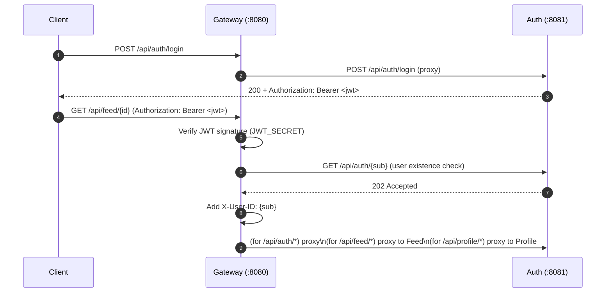
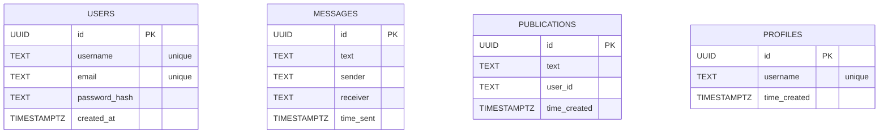

# Wave Connect

Go microservices backend for a small social-style app. It’s composed of an HTTP **gateway** (reverse proxy) plus **auth**, **chat**, **feed**, and **profile** services. Each domain service owns its own **Postgres** database and SQL migrations.

## Repo layout

- `backend-services/`: everything (services + docker compose)
  - `docker-compose.yml`: runs gateway, services, and 4 Postgres containers
  - `gateway-service/`: API gateway (reverse proxy + JWT auth middleware)
  - `auth-service/`: registration/login + JWT issuance
  - `chat-service/`: message CRUD
  - `feed-service/`: publication CRUD
  - `profile-service/`: profile CRUD

## Tech stack

- **Language**: Go
- **HTTP**: Go stdlib `net/http` (`http.ServeMux` route patterns)
- **Style**: straightforward Go services built on stdlib (minimal framework magic)
- **Gateway proxy**: Go stdlib `net/http/httputil` reverse proxy
- **Auth**: JWT (`github.com/golang-jwt/jwt/v5`), password hashing (`golang.org/x/crypto`)
- **DB**: Postgres 16 (Docker), `pgx` (`github.com/jackc/pgx/v5`)
- **Migrations**: `golang-migrate` (`github.com/golang-migrate/migrate/v4`)
- **Config**: `viper` (`github.com/spf13/viper`)
- **Dev orchestration**: Docker + Docker Compose

## Architecture

```mermaid
flowchart TB
  A[Wave Connect]

  A --> C[Client]
  A --> G[Gateway :8080]

  %% Gateway
  subgraph Gateway["Gateway Service (reverse proxy + JWT middleware)"]
    direction TB
    G --> G1[Route mux (ServeMux)]
    G --> G2[JWT middleware]
    G --> G3[Reverse proxy (httputil)]
  end

  %% Domain services
  G -->|proxy| AUTH[Auth :8081]
  G -->|proxy (JWT required)| FEED[Feed :8083]
  G -->|proxy (JWT required)| PROFILE[Profile :8084]
  G -. proxy route currently commented out .-> CHAT[Chat :8082]

  %% Auth service internals
  subgraph AuthService["Auth Service"]
    direction TB
    AUTH --> A1[HTTP handlers]
    AUTH --> A2[JWT issuance]
    AUTH --> A3[Password hashing]
    AUTH --> A4[(Postgres auth_db)]
    AUTH --> A5[SQL migrations]
  end

  %% Feed service internals
  subgraph FeedService["Feed Service"]
    direction TB
    FEED --> F1[HTTP handlers]
    FEED --> F2[Reads X-User-ID from gateway]
    FEED --> F3[(Postgres feed_db)]
    FEED --> F4[SQL migrations]
  end

  %% Profile service internals
  subgraph ProfileService["Profile Service"]
    direction TB
    PROFILE --> P1[HTTP handlers]
    PROFILE --> P2[(Postgres profile_db)]
    PROFILE --> P3[SQL migrations]
  end

  %% Chat service internals
  subgraph ChatService["Chat Service"]
    direction TB
    CHAT --> M1[HTTP handlers]
    CHAT --> M2[(Postgres chat_db)]
    CHAT --> M3[SQL migrations]
  end

  %% Auth verification call (middleware)
  G2 -->|GET /api/auth/{sub}| AUTH

  %% Client entrypoint
  C -->|HTTP| G
```

## Backend internal architecture (per service)

Each domain service follows a simple separation of concerns:

- **API layer**: HTTP handlers + (service-specific) middleware under `api/`
- **Business logic**: service layer under `internal/` (or similar)
- **Data access**: repository/data layer under `internal/` (Postgres via `pgx`)
- **Schema management**: SQL migrations under `migrations/`

## Auth flow (gateway + JWT)

### Login + using the token



### What the gateway enforces

- `POST /api/auth/register` and `POST /api/auth/login` are proxied without JWT.
- Everything under:
  - `/api/auth/`
  - `/api/feed/`
  - `/api/profile/`
  requires `Authorization: Bearer <token>`.
- On successful JWT verification, the gateway forwards `X-User-ID: <jwt subject>` to downstream services (used by feed service).

## API endpoints

### Gateway (recommended entrypoint)

Base URL: `http://localhost:8080`

#### Auth (proxied to auth-service)

- `POST /api/auth/register`
- `POST /api/auth/login`
- `GET /api/auth/{id}` (requires JWT)
- `DELETE /api/auth/{id}` (requires JWT)

#### Feed (proxied to feed-service; requires JWT)

- `POST /api/feed/`
- `GET /api/feed/{id}`
- `PUT /api/feed/{id}`
- `DELETE /api/feed/{id}`

#### Profile (proxied to profile-service; requires JWT)

- `POST /api/profile/`
- `GET /api/profile/{id}`
- `PUT /api/profile/{id}`
- `DELETE /api/profile/{id}`

#### Chat (service exists; gateway proxy currently commented out)

The chat service runs in compose, but the gateway route is currently commented out in `backend-services/gateway-service/api/handlers.go`.

### Direct service ports (Docker)

- Gateway: `http://localhost:8080`
- Auth: `http://localhost:8081`
- Chat: `http://localhost:8082`
- Feed: `http://localhost:8083`
- Profile: `http://localhost:8084`

## Database schemas (from migrations)



## Run locally (Docker Compose)

From repo root:

```bash
cd backend-services
cp .env.example .env
docker compose up --build
```

Then call the gateway at `http://localhost:8080`.

## Environment variables

The compose file reads variables from `.env` (see `backend-services/.env.example`).

- **Gateway**
  - `JWT_SECRET`
  - `AUTH_SERVICE_URL` (e.g. `http://auth:8081`)
  - `CHAT_SERVICE_URL` (e.g. `http://chat:8082`)
  - `FEED_SERVICE_URL` (e.g. `http://feed:8083`)
  - `PROFILE_SERVICE_URL` (e.g. `http://profile:8084`)
- **Per-service Postgres**
  - Auth: `DB_AUTH_USER`, `DB_AUTH_PASSWORD`, `DB_AUTH_NAME`
  - Chat: `DB_CHAT_USER`, `DB_CHAT_PASSWORD`, `DB_CHAT_NAME`
  - Feed: `DB_FEED_USER`, `DB_FEED_PASSWORD`, `DB_FEED_NAME`
  - Profile: `DB_PROFILE_USER`, `DB_PROFILE_PASSWORD`, `DB_PROFILE_NAME`

## Quick test (manual)

```bash
# register
curl -i -X POST http://localhost:8080/api/auth/register \
  -H 'Content-Type: application/json' \
  -d '{"username":"alice","email":"alice@example.com","password":"password"}'

# login (grab the Authorization: Bearer <jwt> header from response)
curl -i -X POST http://localhost:8080/api/auth/login \
  -H 'Content-Type: application/json' \
  -d '{"username":"alice","email":"alice@example.com","password":"password"}'
```

## TODO

- **Chat over WebSockets**: add a WS endpoint (gateway + chat service) for real-time messaging and typing/read receipts